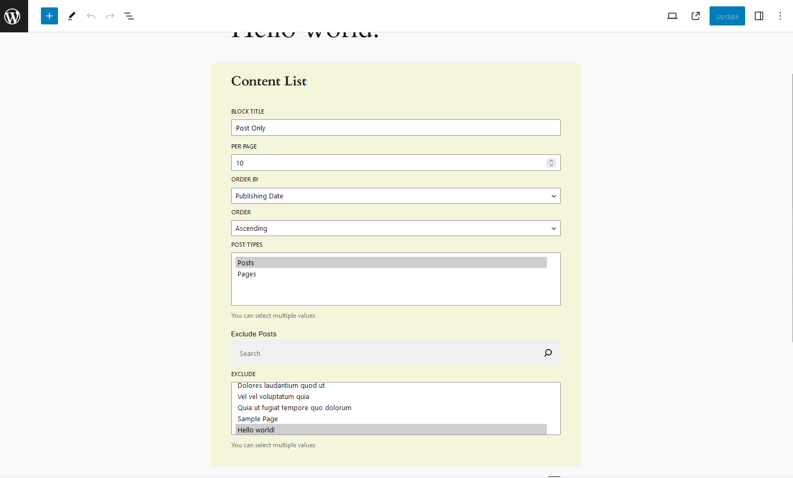
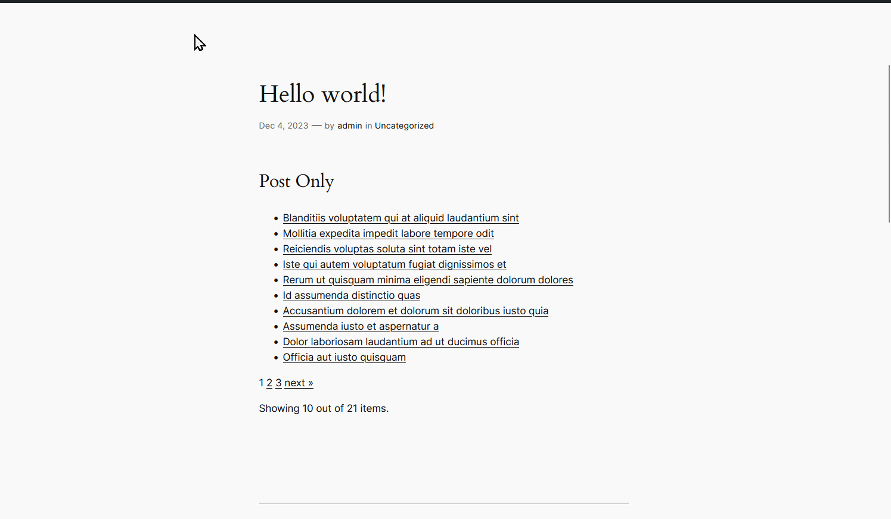

# Gutenberg Sample: Content Lister

This is a simple Gutenberg Block that lets you display a list of content from your WordPress website. The content display is configuration by the following options:

- Block Title
- Per Page (10-50)
- Order By: Name | Date Published
- Order: A/Descending
- Post Type: Restricts posts displayed to that type. Supports custom post type. Ignores meta types.
- Excluded Posts: Exclude certain posts.

## Development

**Recommended**: It's recommended that you use `wp-env` with Docker Desktop. 

However, you can just put this inside the `wp-content/plugins` folder and it should work.

`cd` inside the `content-list` directory and run `yarn` or `npm i` to install the dependencies.

Run the development bundler with `yarn start` or `npm run start`

## Uses

- Typescript
- @wordpress/content
- @wordpress/elements
- @wordpress/api-fetch
- @wordpress/components for the Admin UI.